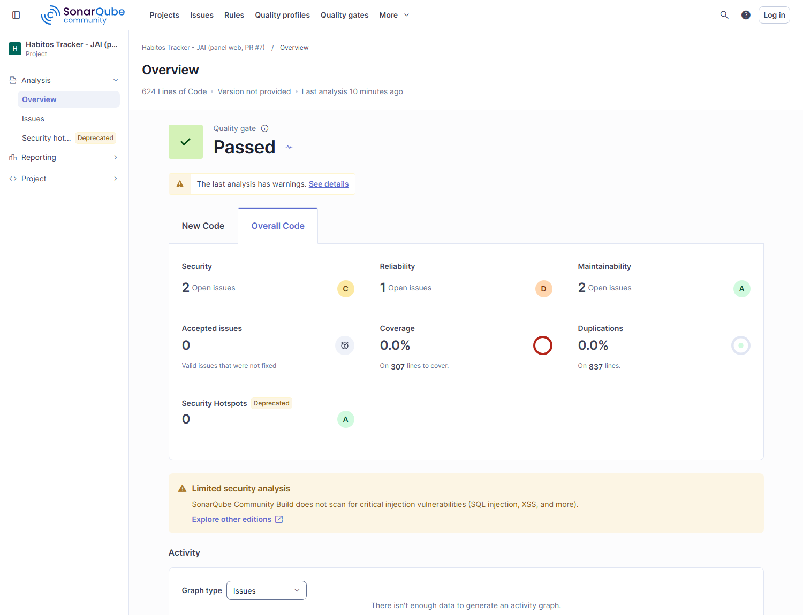
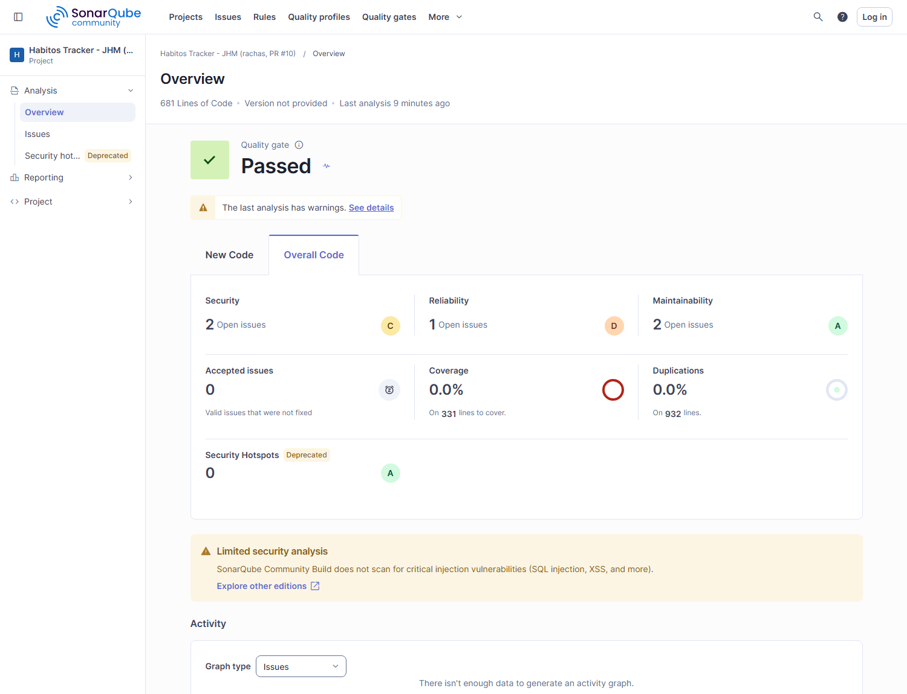
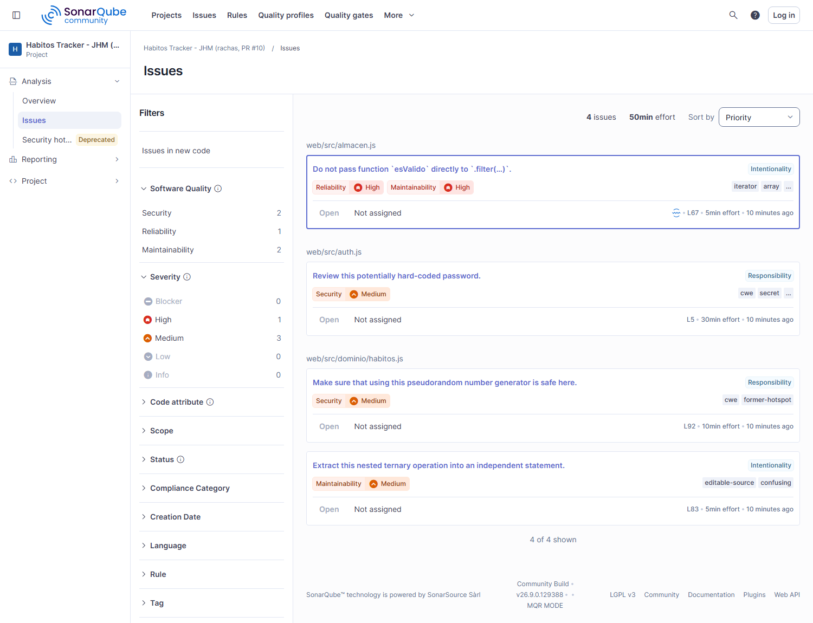

# Resultados del análisis estático (SonarQube)

> Actividad 1.2 — CI/CD. Ejecución de la [guía de SonarQube local](./guia-sonarqube-local.md). Cada
> integrante escaneó el código de su Pull Request de la primera unidad, en su propio proyecto de
> SonarQube.

## 1. Cómo se ejecutó

| | JAI — Joel Armando Ibarra Rubalcava | JHM — Jorge Humberto Martínez Delgado |
|---|---|---|
| Proyecto en SonarQube | `habitos-tracker-jai` | `habitos-tracker-jhm` |
| PR de la primera unidad | [#7 — panel web, e2e y guía](https://github.com/joeljorex/habitos-tracker/pull/7) | [#10 — módulo de rachas](https://github.com/joeljorex/habitos-tracker/pull/10) |
| Rama analizada | `develop` (con el PR #7 ya integrado) | `feature/004-logica-rachas` |
| Commit | `10d2b0f` | `d829eb0` |
| Escáner | `sonarsource/sonar-scanner-cli` en contenedor | igual |
| Servidor | SonarQube Community, stack local en Docker | igual |

```bash
npm run sonar:levantar
SONAR_TOKEN=squ_… ./scripts/sonar-escaneo.sh habitos-tracker-jai "Habitos Tracker - JAI"
SONAR_TOKEN=squ_… ./scripts/sonar-escaneo.sh habitos-tracker-jhm "Habitos Tracker - JHM"
```

## 2. Medidas obtenidas

| Medida | JAI | JHM | Qué significa |
|---|---|---|---|
| Líneas de código | 624 | 681 | el proyecto de JHM suma el módulo de rachas |
| Archivos analizados | 8 | 9 | — |
| Funciones | 91 | 100 | — |
| Bugs | 1 | 1 | errores que pueden fallar en ejecución |
| Vulnerabilidades | 2 | 2 | riesgos de seguridad |
| Security hotspots | 0 | 0 | código que exige revisión manual |
| Code smells | 1 | 1 | deuda técnica |
| Deuda técnica (`sqale_index`) | 5 min | 5 min | esfuerzo estimado para limpiarla |
| Duplicación | 0.0 % | 0.0 % | no hay bloques repetidos |
| Complejidad ciclomática | 183 | 205 | caminos de ejecución |
| Complejidad cognitiva | 94 | 109 | qué tan difícil es de leer |
| Calificación de mantenibilidad | A | A | — |
| Calificación de fiabilidad | C | C | la baja el bug encontrado |
| Calificación de seguridad | C | C | la bajan las dos vulnerabilidades |
| **Quality gate** | **OK** | **OK** | el código nuevo cumple las condiciones |

## 3. Hallazgos

Los cuatro hallazgos son los mismos en ambos proyectos, porque están en archivos que las dos ramas
comparten. El módulo `rachas.js` de JHM no agregó ningún hallazgo nuevo.

| # | Tipo | Severidad | Archivo y línea | Regla | Qué dice |
|---|---|---|---|---|---|
| 1 | Bug | Mayor | `web/src/almacen.js:67` | `javascript:S7727` | No pasar la función `esValido` directamente a `.filter(…)`: `filter` le manda tres argumentos (elemento, índice y arreglo) y la función podría interpretarlos mal |
| 2 | Vulnerabilidad | Mayor | `web/src/auth.js:5` | `javascript:S2068` | Revisar una contraseña escrita en el código: es la cuenta de demostración `Habitos123` |
| 3 | Code smell | Mayor | `web/src/dominio/habitos.js:83` | `javascript:S3358` | Sacar un operador ternario anidado a una sentencia aparte, porque cuesta leerlo |
| 4 | Vulnerabilidad | Mayor | `web/src/dominio/habitos.js:92` | `javascript:S2245` | Confirmar que usar `Math.random()` es seguro aquí |

## 4. Análisis y plan de corrección

| # | ¿Es un problema real? | Qué se hará | Cuándo |
|---|---|---|---|
| 1 | **Sí.** Si alguien agrega un segundo parámetro a `esValido`, `filter` le pasaría el índice y el filtrado quedaría mal sin avisar | envolverla: `.filter((h) => esValido(h))` | siguiente PR de mantenimiento |
| 2 | **No, en este contexto.** Es la cuenta de demostración del panel, documentada en los casos de prueba; no hay backend ni datos reales | se marcará como *Won't fix* con la justificación, y desaparecerá al llegar la autenticación real con Sanctum (spec 005) | al implementar la API |
| 3 | **Sí, de legibilidad.** El ternario anidado calcula el estado del hábito | extraer a una función con nombre | siguiente PR de mantenimiento |
| 4 | **No.** `Math.random()` solo genera identificadores locales de hábitos, no tokens ni contraseñas | se sustituirá por `crypto.randomUUID()`, que además evita colisiones | siguiente PR de mantenimiento |

Ninguno bloquea la entrega: el quality gate está en verde porque las condiciones se evalúan sobre el
código nuevo y ninguno de estos hallazgos introduce un riesgo en producción.

## 5. Evidencia

### JAI — `habitos-tracker-jai`




### JHM — `habitos-tracker-jhm`





Los datos crudos de cada escaneo (hallazgos y medidas, tal como los devuelve la API de SonarQube)
están en [`docs/evidencia/`](./evidencia/).

## 6. Qué sigue

1. Corregir los hallazgos 1, 3 y 4 en un PR de mantenimiento y volver a escanear.
2. Agregar el reporte de cobertura (`coverage/lcov.info`) al escaneo, para que el tablero también
   muestre qué tanto cubren las pruebas.
3. Cuando exista una instancia de SonarQube accesible desde internet, activar
   [`.github/workflows/calidad.yml`](../.github/workflows/calidad.yml) para que el análisis corra
   solo en cada Pull Request.
