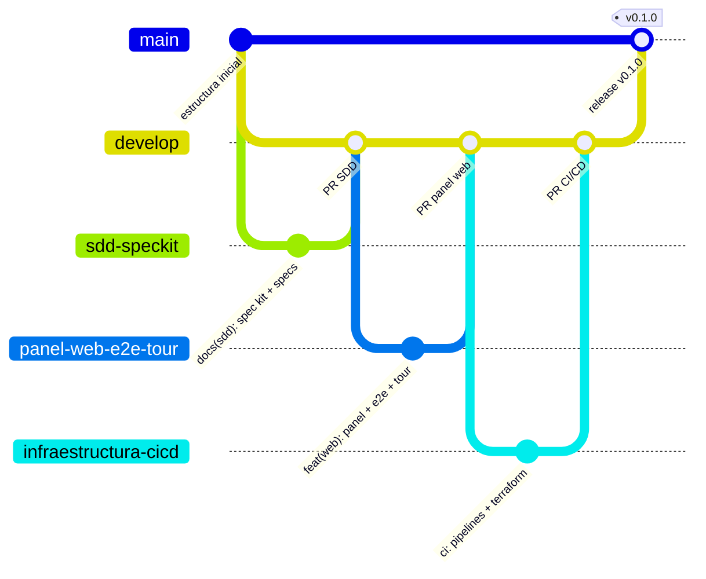
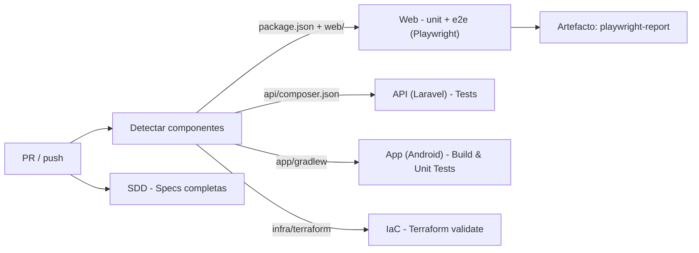
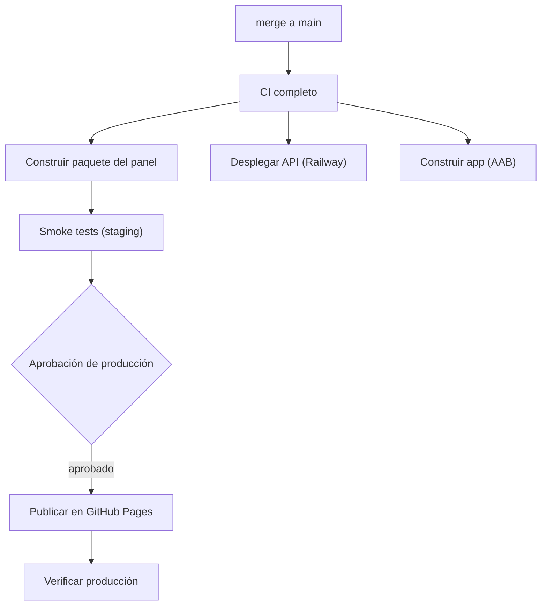

# Flujo de Trabajo para Control de Versiones y CI/CD

## Estrategia de branching

*(En el diagrama se omite el prefijo `feature/` de las ramas por legibilidad.)*

- **`main`**: siempre desplegable. Solo recibe merges desde `develop` mediante un PR de release;
  cada merge dispara el pipeline de CD.
- **`develop`**: rama de integración. Recibe los `feature/*` por PR con CI en verde y la
  aprobación del otro integrante.
- **`feature/*`**: una por funcionalidad o ticket (`feature/004-logica-rachas`). Se crea desde
  `develop` y se borra al integrarse.
- **`hotfix/*`** (excepcional): desde `main` para un error en producción; se integra a `main` y
  a `develop`.

## Convención de commits

Conventional Commits:

| Tipo | Uso | Ejemplo |
|---|---|---|
| `feat` | funcionalidad nueva | `feat(web): módulo de rachas con casos de referencia` |
| `fix` | corrección | `fix(web): no duplicar registro al hacer doble clic` |
| `test` | pruebas | `test(e2e): automatizar CP-07` |
| `docs` | documentación y specs | `docs(sdd): constitución v1.0.0` |
| `ci` | pipelines | `ci: smoke tests contra producción` |
| `chore` | mantenimiento | `chore: actualizar driver.js a 1.8.1` |
| `refactor` | cambio interno sin alterar comportamiento | `refactor(web): extraer almacen.js` |

## Flujo de Pull Request

1. Issue/ticket con el objetivo y los criterios de aceptación.
2. `git switch develop && git pull && git switch -c feature/<nombre>`.
3. Si es funcionalidad nueva: spec, plan y tareas con Spec Kit (skill `nuevo-modulo-sdd`).
4. Commits pequeños con Conventional Commits.
5. PR hacia `develop` con la plantilla (`.github/pull_request_template.md`): ticket, qué se hizo,
   archivos, uso, spec, casos y evidencia.
6. GitHub Actions ejecuta la CI (sección siguiente).
7. Revisión y aprobación del **otro integrante** (obligatoria).
8. Merge solo con todos los checks en verde; se borra la rama.

## Pipeline de CI (Integración Continua)

Definido en [`.github/workflows/ci.yml`](../.github/workflows/ci.yml). Se dispara en cada PR hacia
`main` o `develop`, en cada push a `develop` y como primera etapa del CD.

| Check | Qué verifica |
|---|---|
| `Detectar componentes` | qué partes del monorepo tienen código |
| `Web - unit + e2e (Playwright)` | pruebas unitarias del dominio y e2e en escritorio y móvil; publica el reporte HTML |
| `API (Laravel) - Tests` | `php artisan test` (se omite mientras `api/` no tenga código) |
| `App (Android) - Build & Unit Tests` | `./gradlew testDebugUnitTest` (se omite mientras `app/` no tenga código) |
| `IaC - Terraform validate` | formato y validez de `infra/terraform/` |
| `SDD - Specs completas` | cada carpeta de `specs/` tiene `spec.md`, `plan.md` y `tasks.md` |

Un job omitido porque su componente no existe cuenta como exitoso; así la misma protección de
ramas sirve hoy y cuando llegue el código de la API y de la app.

## Pipeline de CD (Despliegue Continuo)

Definido en [`.github/workflows/cd.yml`](../.github/workflows/cd.yml). Se dispara con cada push a
`main` (merge del PR de release) o manualmente. Detalle en
[estrategia-despliegue.md](./estrategia-despliegue.md).

## Reglas de protección de rama

Declaradas como código en [`infra/terraform/github.tf`](../infra/terraform/github.tf):

| Rama | PR obligatorio | Aprobaciones | Checks requeridos | Push directo / force-push / borrado |
|---|---|---|---|---|
| `main` | Sí | 1 | los 6 checks de CI (rama al día) | No |
| `develop` | Sí | 1 | los 6 checks de CI (rama al día) | No |

Si no se aplica Terraform, se configuran a mano en **Settings → Branches → Add rule** con los
mismos valores.

## Orden de los PRs de esta entrega

| # | Rama | Responsable | Contenido | Depende de |
|---|---|---|---|---|
| 1 | `feature/sdd-speckit` | Joel | Spec Kit, constitución, skills, specs 001–004, guía de instalación | — |
| 2 | `feature/panel-web-e2e-tour` | Joel | Panel web, suite Playwright, guía driver.js | PR 1 |
| 3 | `feature/ingenieria-inversa` | Jorge | Ingeniería inversa, ER, trazabilidad | — |
| 4 | `feature/003-infraestructura-cicd` | Jorge | CI, CD, Codespaces, Terraform | PR 1 |
| 5 | `feature/004-logica-rachas` | Jorge | Módulo de rachas | PR del panel |
| 6 | `develop` → `main` | Joel | Release v0.1.0 (dispara el CD) | todos |
