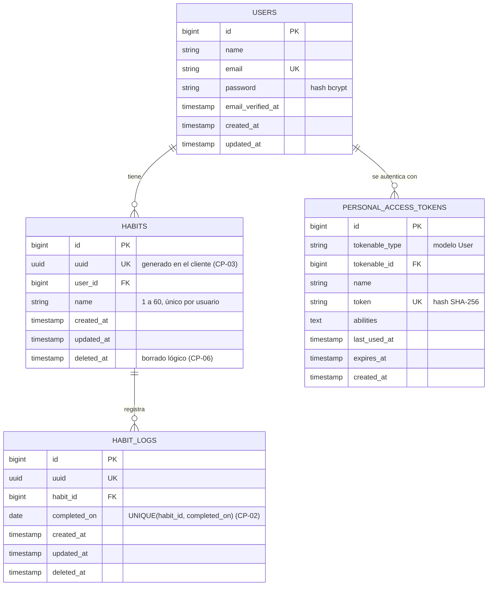
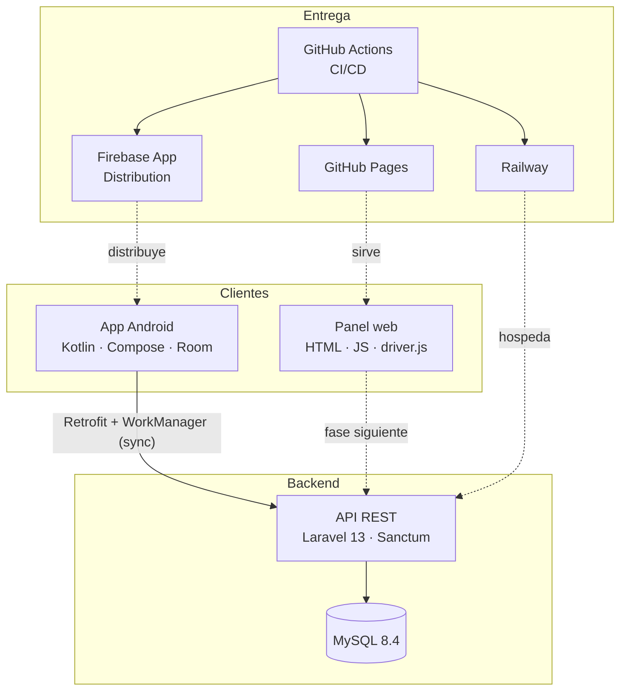

# Ingeniería inversa del estado actual

## 1. Objetivo y alcance

Reconstruir, a partir de lo que existe en el repositorio (commit `eab38ad`, 10 de septiembre de
2026), los requisitos, el modelo de datos, la arquitectura y la trazabilidad que el proyecto
tiene implícitos, para:

1. documentar el estado actual con evidencia;
2. detectar inconsistencias entre lo documentado y lo que existe;
3. definir con Spec Kit la evolución piloto (specs 001–004).

## 2. Método

1. **Inventario**: `git log`, `git ls-files`, ramas remotas y API pública de GitHub (PRs, issues,
   autores).
2. **Extracción**: lectura de cada documento y registro de afirmaciones verificables
   (requisitos, decisiones, comandos, nombres de archivos).
3. **Contraste**: cada afirmación contra la evidencia del repositorio.
4. **Modelo**: entidades y reglas inferidas de los casos de prueba y de las decisiones técnicas
   (Room, Sanctum, `/habits/{id}/logs`, offline-first).
5. **Síntesis**: matriz de trazabilidad ([trazabilidad.md](./trazabilidad.md)) y análisis de brechas.

## 3. Inventario

### 3.1 Archivos

| Ruta | Tipo | Contenido |
|---|---|---|
| `README.md` | Documento | Descripción, estructura, componentes "por iniciar", cómo levantar |
| `.gitignore` | Configuración | Reglas para Android, Laravel y generales |
| `.github/workflows/ci.yml` | Pipeline | 2 jobs (`api-tests`, `app-tests`) con `if: false` |
| `app/.gitkeep`, `api/.gitkeep` | Marcadores | Carpetas vacías |
| `docs/parametros-configuracion.md` | Documento | Stack, versiones, branching, plan de instalación |
| `docs/plan-de-pruebas.md` | Documento | Niveles de prueba, Appium, entornos, comandos, criterios |
| `docs/casos-de-prueba.md` | Documento | CP-01 a CP-06 |
| `docs/flujo-cicd.md` | Documento | Branching, commits, PR, CI, CD, protección de ramas |
| `docs/estrategia-despliegue.md` | Documento | Firebase App Distribution, Railway, pipeline, monitoreo |
| `docs/sdd-proposal.md` | Documento | Kiro vs Spec Kit, pilotos |
| `docs/sdd-implementation.md` | Documento | Guía de Spec Kit |

### 3.2 Historial y colaboración

| Métrica | Valor |
|---|---|
| Commits | 10 (2026-09-07 → 2026-09-10) |
| Cuentas que hicieron commit | 1 (`JMartinez-D`, autor local "DonQuetzal") |
| Ramas remotas | `main` |
| Pull Requests | 0 |
| Issues | 0 |
| Convención de commits | Conventional Commits (`chore:`, `docs:`, `merge:`) ✅ |

### 3.3 Componentes declarados contra existentes

| Componente | Declarado en | ¿Existe? |
|---|---|---|
| App Android | README, parámetros | ❌ solo `.gitkeep` |
| API Laravel | README, parámetros | ❌ solo `.gitkeep` |
| `docker-compose.yml` | parámetros, plan de pruebas | ❌ |
| Pipeline de CI | `ci.yml` | ⚠️ existe, pero no ejecuta nada |
| Pipeline de CD | flujo CI/CD, despliegue | ❌ |
| Protección de ramas | flujo CI/CD ("a configurar") | ❌ |
| Panel web | plan de pruebas ("si en el futuro…") | ❌ |

## 4. Requisitos recuperados

### 4.1 Funcionales

| ID | Requisito recuperado | Fuente |
|---|---|---|
| RF-01 | Registro e inicio de sesión | parámetros (Sanctum), plan de pruebas (E2E), CP-05 |
| RF-02 | Crear hábito con nombre obligatorio | CP-01 |
| RF-03 | Marcar un hábito como completado como máximo una vez al día | README, CP-02 |
| RF-04 | Calcular racha actual y máxima; reiniciar al saltar un día | README, plan de pruebas (Unit), CP-04 |
| RF-05 | Funcionar sin conexión y sincronizar al reconectar | README (offline-first), CP-03 |
| RF-06 | Eliminar hábito junto con sus registros, también en el backend | CP-06 |
| RF-07 | API REST `/auth`, `/habits`, `/habits/{id}/logs` | sdd-proposal (pilotos) |
| RF-08 | Endpoint de salud `/api/health` | estrategia de despliegue |
| RF-09 | Editar hábito | CP-03 ("crear/editar") |
| RF-10 | Distribuir builds de prueba de la app | estrategia de despliegue |
| RF-11 | Panel web para consultar y gestionar hábitos | nuevo (rúbrica: caso de estudio web) → spec 001 |
| RF-12 | Guía interactiva de primer uso | nuevo (rúbrica: piloto b) → spec 002 |

### 4.2 No funcionales

| ID | Requisito recuperado | Fuente |
|---|---|---|
| RNF-01 | Android minSdk 24 / targetSdk 36 | parámetros |
| RNF-02 | Laravel 13 (PHP 8.3+), MySQL 8.4, entorno Docker | parámetros |
| RNF-03 | Cobertura ≥ 70 % en lógica crítica (rachas, sincronización) | plan de pruebas |
| RNF-04 | La CI bloquea merges con pruebas en rojo | plan de pruebas, flujo CI/CD |
| RNF-05 | Secretos fuera del repositorio | estrategia de despliegue |
| RNF-06 | Despliegue con staging, smoke test y aprobación manual | flujo CI/CD, despliegue |
| RNF-07 | Branching `main`/`develop`/`feature/*` y Conventional Commits | parámetros, flujo CI/CD |
| RNF-08 | Entornos reproducibles | parámetros (justificación de Docker) |

## 5. Modelo de datos inferido (ER)

Entidades y atributos deducidos de los requisitos: Sanctum implica `users` y
`personal_access_tokens`; `/habits/{id}/logs` implica `habits` 1–N `habit_logs`; CP-02 implica
unicidad por día; CP-03 (crear sin conexión) implica un identificador generado en el cliente;
CP-06 ("tras sync, desaparece del backend") implica borrado lógico para propagar el borrado a
otros dispositivos.

### 5.1 Reglas e invariantes

| Regla | Origen | Dónde se garantiza |
|---|---|---|
| Nombre de hábito obligatorio, 1–60 caracteres, único por usuario | CP-01, spec 001 | validación de dominio + índice único |
| Como máximo un registro por hábito y día | CP-02 | `UNIQUE(habit_id, completed_on)` + `marcarHecho` idempotente |
| Borrar un hábito borra sus registros | CP-06 | cascada (lógica en API, física en el panel) |
| La racha no se almacena: se calcula | spec 004 (R3) | `calcularRachas(fechas, hoy)` |
| Un cliente crea registros sin conexión | CP-03 | `uuid` generado en el cliente |

### 5.2 Correspondencia entre clientes

| Concepto | API (MySQL) | App (Room) | Panel web (localStorage) |
|---|---|---|---|
| Hábito | `habits` | `HabitEntity(uuid, name, updatedAt, deletedAt, syncStatus)` | `habitos.v1.habitos` |
| Registro | `habit_logs` | `HabitLogEntity(uuid, habitUuid, completedOn, syncStatus)` | `habitos.v1.registros` |
| Sesión | `personal_access_tokens` | token cifrado (DataStore) | `habitos.v1.sesion` (simulada) |
| Racha | calculada | calculada | calculada |

## 6. Arquitectura recuperada

## 7. Hallazgos

| ID | Hallazgo | Evidencia | Impacto | Resolución |
|---|---|---|---|---|
| H-01 | La CI no ejecuta ninguna prueba | `ci.yml`: `if: false` en ambos jobs | No hay evidencia de pruebas; la protección de ramas sería decorativa | Spec 003: detección de componentes |
| H-02 | No existe pipeline de CD | no hay `cd.yml` | El despliegue documentado no ocurre | Spec 003: `cd.yml` con Pages |
| H-03 | El flujo de ramas documentado no se sigue | 10 commits directos a `main`, 0 PRs | Contradice `flujo-cicd.md`; un solo integrante con evidencia | PRs por integrante + protección con Terraform |
| H-04 | Comando e2e incorrecto | `./gradlew connectedDebugAndroidTest` ejecuta pruebas instrumentadas, no Appium | Suite e2e mal documentada | Plan de pruebas corregido |
| H-05 | README contradice los parámetros | `php artisan serve` vs `docker-compose up -d` | Instalación ambigua | README alineado con Docker/Codespaces |
| H-06 | El plan dice que la CI usa docker-compose | `ci.yml` usa `setup-php` | Documento y pipeline divergen | Contrato de pipelines (spec 003) |
| H-07 | Se menciona un paso de lint que no existe | `flujo-cicd.md` vs `ci.yml` | Expectativa falsa | `actionlint` y `terraform fmt` en CI; lint de código con cada componente |
| H-08 | Comandos de Spec Kit desactualizados | `/specify`, `/plan` en la guía | La guía no funciona con la versión actual | `/speckit-*` (v1.0.6) |
| H-09 | La rúbrica pide caso de estudio web; el proyecto solo tenía app nativa | driver.js y Selenium operan sobre el DOM | Pilotos a) y b) inaplicables | Panel web (spec 001) |
| H-10 | Pilotos de SDD distintos a los de la rúbrica | rachas/API/sync vs a/b/c | Entregable desalineado | Specs 001–003 + rachas como extra (004) |
| H-11 | "Autorevisión, proyecto individual" en un equipo de 2 | `flujo-cicd.md` | Sin revisión cruzada | 1 aprobación obligatoria del otro integrante |
| H-12 | Entorno local incompatible | PHP 8.2.12 (Laravel 13 exige 8.3+); Java 8 en PATH (Gradle exige 17) | "En mi máquina no funciona" | Codespaces y Docker (spec 003) |
| H-13 | `docker-compose.yml` referido pero ausente | parámetros, plan de pruebas | Pasos de instalación no ejecutables | Backlog: spec 005 (API) |
| H-14 | Casos sin vínculo a requisitos ni automatización | `casos-de-prueba.md` | Cobertura no medible | [trazabilidad.md](./trazabilidad.md) |

## 8. Antes y después

| Métrica | Antes (eab38ad) | Después de los PRs de esta entrega |
|---|---|---|
| Specs formales | 0 | 4 |
| Casos de prueba documentados | 6 | 13 (+ 13 casos de referencia de rachas) |
| Casos automatizados | 0 | 12 de 13 (CP-03 requiere la app Android) |
| Jobs de CI que ejecutan algo | 0 de 2 | 6 (los de API y app se activan solos cuando exista su código) |
| Pipelines de CD | 0 | 1 (Pages con staging, aprobación y verificación) |
| Pull Requests | 0 | 5 + 1 de release |
| Integrantes con commits | 1 | 2 |

## 9. Conclusión

El proyecto tenía una planeación sólida en texto pero sin mecanismos que la hicieran cumplir:
ninguna prueba se ejecutaba, el flujo de ramas no se usaba y los pilotos de SDD no coincidían
con los que pide la asignatura. La ingeniería inversa permitió recuperar 12 requisitos
funcionales y 8 no funcionales, un modelo de datos de 4 entidades y 14 hallazgos. Con esa base
se escribieron las specs 001–004 con Spec Kit y se planificaron las siguientes: `005-contrato-api`
(RF-07, RF-08), `006-sync-offline` (RF-05, RF-09) y `007-app-android-mvp`.
