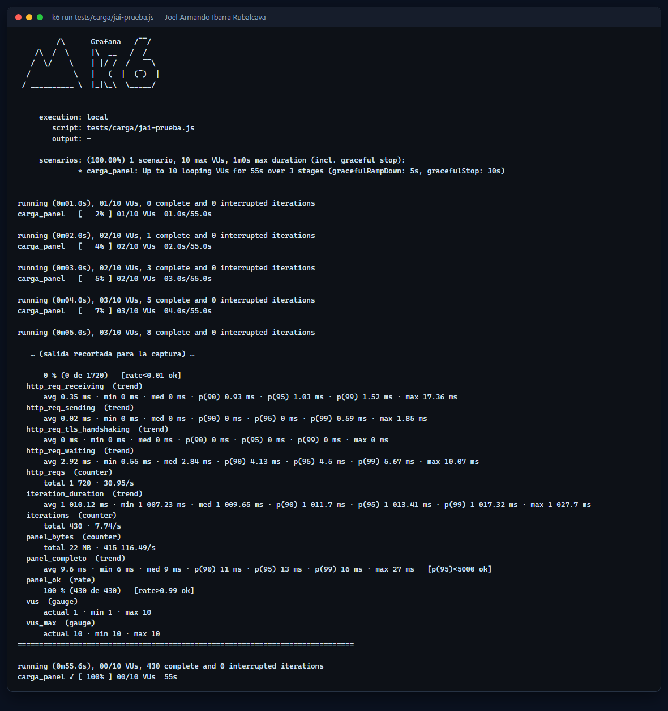
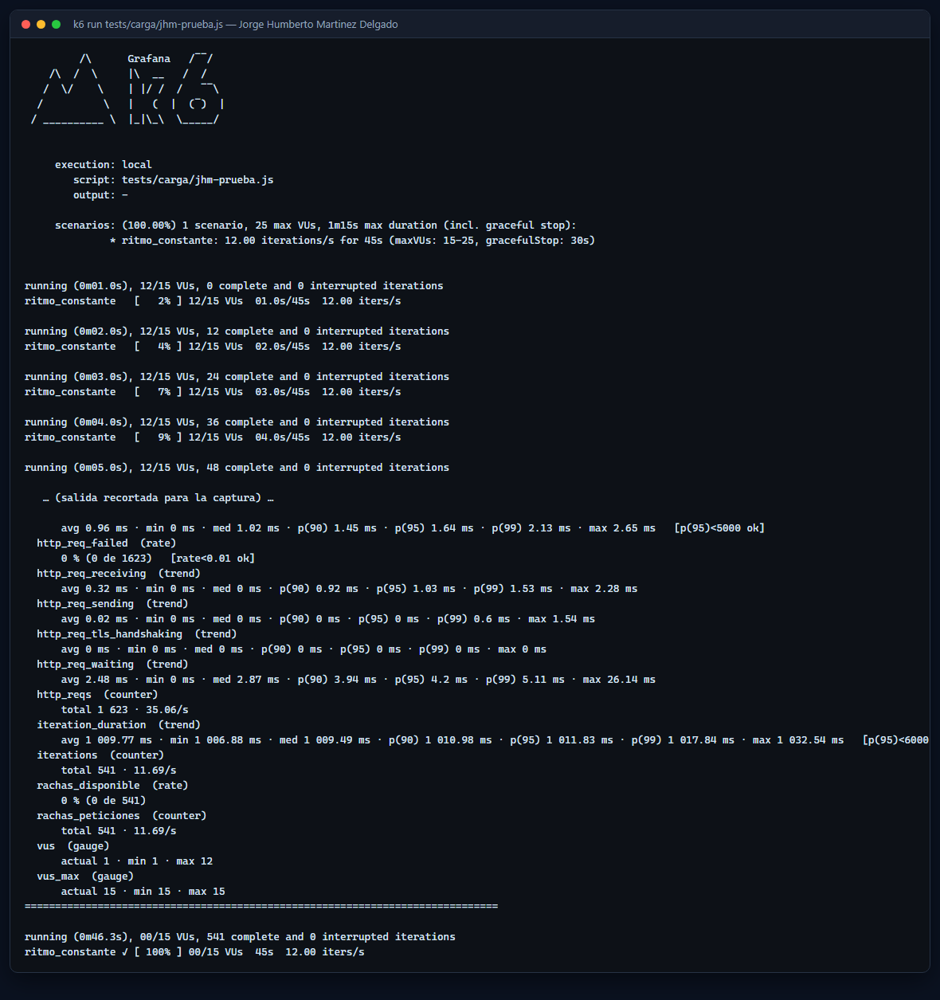
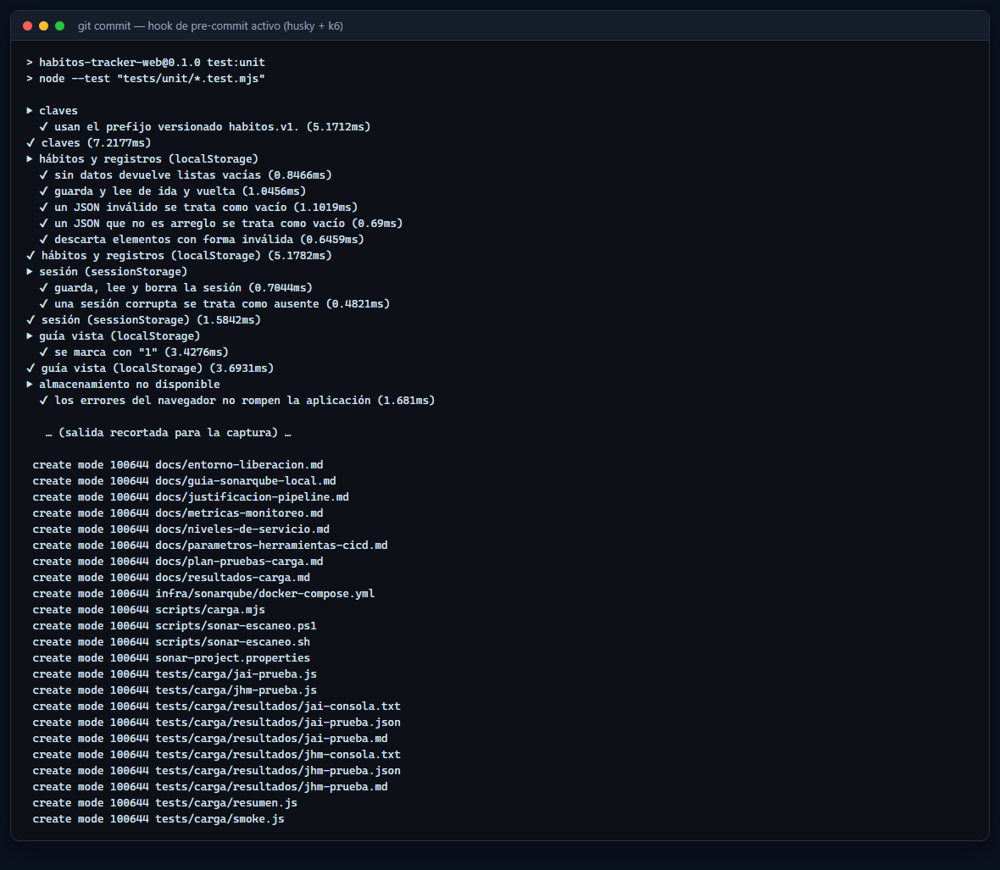
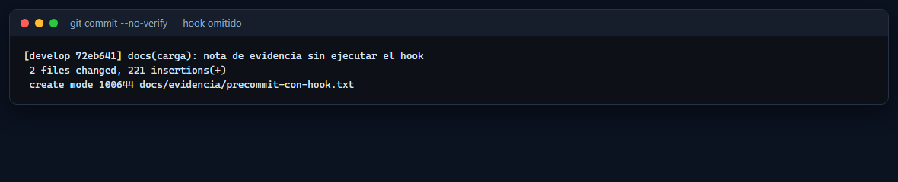

# Resultados de las pruebas de carga

> Actividad 1.2 — CI/CD. Ejecución del [plan de pruebas de carga](./plan-pruebas-carga.md). Una
> prueba por integrante, con su script y sus métricas. Los reportes completos y los datos crudos
> están en [`tests/carga/resultados/`](../tests/carga/resultados/).

## 1. Resumen

| | JAI — Joel Armando Ibarra Rubalcava | JHM — Jorge Humberto Martínez Delgado |
|---|---|---|
| Script | [`tests/carga/jai-prueba.js`](../tests/carga/jai-prueba.js) | [`tests/carga/jhm-prueba.js`](../tests/carga/jhm-prueba.js) |
| Escenario | rampa de 1 a 10 usuarios virtuales | ritmo constante de 12 iteraciones/s |
| Usuarios virtuales | 10 (máximo alcanzado) | 12 activos, 15 reservados |
| Duración | 55.57 s | 46.29 s |
| Peticiones | 1 720 (30.95/s) | 1 623 (35.06/s) |
| Iteraciones | 430 | 541 |
| **p95 de respuesta** | **4.88 ms** | **4.53 ms** |
| p99 de respuesta | 6.39 ms | 5.24 ms |
| Máximo | 20.96 ms | 26.14 ms |
| Peticiones con error | 0 % (0 de 1 720) | 0 % (0 de 1 623) |
| Verificaciones | 100 % (2 580) | 100 % (2 705) |
| Datos recibidos | 23.17 MB | 10.97 MB |
| Umbrales cruzados | ninguno | ninguno |
| Código de salida de k6 | 0 | 0 |

**Objetivo de la actividad: p95 < 5 s.** Las dos pruebas quedan en milisegundos, tres órdenes de
magnitud por debajo del límite, porque el panel es estático y se sirve desde el mismo equipo. El
valor del ejercicio está en que el umbral quedó escrito como código: si una versión futura tarda más
de 5 s, k6 termina con error y el pipeline detiene el PR.

## 2. Prueba de JAI — primera carga del panel

Reproduce lo que hace un navegador la primera vez que alguien abre el panel: pide el documento y
enseguida sus tres recursos, todo dentro de una misma iteración agrupada.

| Endpoint | p95 | Máximo |
|---|---|---|
| `GET /` (documento) | 5.30 ms | 20.96 ms |
| `GET /src/app.js` y `GET /vendor/driver.js/…` (scripts) | 3.86 ms | 10.34 ms |
| `GET /css/estilos.css` (estilos) | 5.21 ms | 10.58 ms |

Métricas propias:

| Métrica | Valor | Qué significa |
|---|---|---|
| `panel_completo` | p95 13 ms, máx 27 ms | cuánto tarda la carga completa, no una sola petición |
| `panel_ok` | 100 % (430 de 430) | ninguna carga quedó incompleta |
| `panel_bytes` | 22 MB | total descargado durante la prueba |
| `documento_bytes` | 4.64 kB | peso del HTML del panel |

Reporte completo: [`jai-prueba.md`](../tests/carga/resultados/jai-prueba.md) ·
datos crudos: [`jai-prueba.json`](../tests/carga/resultados/jai-prueba.json) ·
salida de consola: [`jai-consola.txt`](../tests/carga/resultados/jai-consola.txt)



## 3. Prueba de JHM — ritmo constante

Mantiene 12 iteraciones por segundo sin importar la velocidad de respuesta, que es como se mide un
servicio en producción. Incluye el módulo de rachas del PR #10.

| Endpoint | p95 | Observación |
|---|---|---|
| `GET /` (documento) | 4.53 ms | — |
| `GET /css/estilos.css` | 4.53 ms | 14.26 kB por petición |
| `GET /src/dominio/rachas.js` | 1.64 ms | responde 404 mientras el PR #10 no se integra |

Métricas propias:

| Métrica | Valor | Qué significa |
|---|---|---|
| `estilos_duracion` | p95 4.53 ms | tiempo dedicado solo a la hoja de estilos |
| `estilos_bytes` | 14.26 kB | peso de la hoja de estilos |
| `rachas_peticiones` | 541 | veces que se pidió el módulo de rachas |
| `rachas_disponible` | 0 % | el módulo llega con el PR #10; al integrarlo sube a 100 % |
| `iteration_duration` | p95 1 011.83 ms | cada iteración incluye la pausa de 1 s del usuario simulado |

El script marca ese endpoint con `http.expectedStatuses(200, 404)`, así que el 404 se mide pero no
cuenta como petición fallida: por eso `http_req_failed` queda en 0 %.

Reporte completo: [`jhm-prueba.md`](../tests/carga/resultados/jhm-prueba.md) ·
datos crudos: [`jhm-prueba.json`](../tests/carga/resultados/jhm-prueba.json) ·
salida de consola: [`jhm-consola.txt`](../tests/carga/resultados/jhm-consola.txt)



## 4. Cómo se reproduce

```bash
npm install                 # registra los hooks de husky
npm run carga:jai           # prueba de Joel
npm run carga:jhm           # prueba de Jorge
```

El lanzador levanta el panel en el puerto 4180, corre k6 y lo apaga. Los reportes se regeneran en
`tests/carga/resultados/`.

## 5. Uso dentro del CI/CD: con y sin el hook

La prueba de humo está enganchada a `git commit` mediante husky
([`.husky/pre-commit`](../.husky/pre-commit)). Es opcional: si k6 no está instalado, el hook avisa y
deja pasar el commit.

| Caso | Comando | Qué ocurre | Evidencia |
|---|---|---|---|
| Con el hook | `git commit -m "..."` | corre `test:unit` y la carga de humo (6 VUs, 10 s); si el p95 pasa de 5 s, el commit se cancela |  |
| Sin el hook | `git commit --no-verify -m "..."` | el commit entra de inmediato, sin validar rendimiento |  |

**Cuándo conviene cada uno.** El hook local da la señal más temprana posible, que es donde más barato
sale corregir, pero agrega unos 15 segundos a cada commit; por eso solo corre la prueba de humo. La
prueba completa vive en el pipeline: en cada Pull Request corre la de humo en el runner, y al
integrar a `main` corren las dos pruebas por integrante. Saltarse el hook con `--no-verify` es
aceptable para un commit de documentación, y el PR igual vuelve a validar en la CI.

## 6. Conclusiones

1. El panel cumple el objetivo de servicio (`p95 < 5 s`) con margen amplio.
2. No hubo ninguna petición fallida ni verificación en rojo en las dos pruebas.
3. Los umbrales quedan versionados: una regresión de rendimiento rompe el pipeline sola.
4. Cuando exista la API en Laravel (spec 005), se agregan sus endpoints al mismo plan y estos
   mismos umbrales aplican con cifras más realistas, ya que habrá base de datos de por medio.
