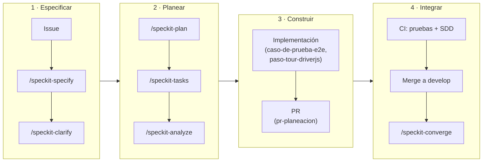

# Propuesta de Spec-Driven Development (SDD)

## Contexto

El proyecto no tenía código de producto, pero sí un **sistema documental**: 7 documentos de
planeación, un pipeline de CI base y la estructura `app/`, `api/`, `docs/`. Esa es la situación
actual sobre la que se hizo ingeniería inversa ([ingenieria-inversa.md](./ingenieria-inversa.md)):
se recuperaron requisitos, modelo de datos, arquitectura y trazabilidad a partir de lo escrito, y
con esa base se usó Spec Kit para definir la evolución piloto del sistema.

## Diagnóstico del estado actual (antes de SDD)

| Aspecto | Estado encontrado |
|---|---|
| Código de producto | Ninguno (`app/` y `api/` solo con `.gitkeep`) |
| Documentación | 7 archivos en `docs/` sin vínculos entre requisitos, casos y pruebas |
| Especificaciones formales | Ninguna |
| Repositorio | Solo `main`; 10 commits desde una cuenta; 0 PRs; 0 issues |
| CI | `ci.yml` con ambos jobs en `if: false`: no ejecuta ninguna prueba |
| CD | Descrito en documentos, sin workflow |
| Casos de prueba | CP-01 a CP-06, manuales, sin automatizar |
| Herramientas de SDD evaluadas | Kiro (AWS) y GitHub Spec Kit |

## Qué falta para SDD formal

| Elemento de SDD formal | Antes | Con esta propuesta |
|---|---|---|
| Fuente única de verdad (constitución) | ❌ | ✅ `.specify/memory/constitution.md` v1.0.0 |
| Spec por funcionalidad antes del código | ❌ | ✅ `specs/001` a `specs/004` |
| Flujo repetible spec → plan → tareas → código | ❌ | ✅ skills `speckit-*` + skill `nuevo-modulo-sdd` |
| Trazabilidad requisito → caso → prueba → PR | ❌ | ✅ [trazabilidad.md](./trazabilidad.md) |
| Barrera automática (no se integra sin spec) | ❌ | ✅ check de CI `SDD - Specs completas` |
| Specs vivas (se actualizan con el código) | ❌ | ✅ `/speckit-converge` y revisión de spec en cada PR |
| Specs de API y sincronización offline | ❌ | ⏳ backlog: `005-contrato-api`, `006-sync-offline` |

## Comparación: Kiro vs Spec Kit

| Criterio | Kiro (AWS) | GitHub Spec Kit |
|---|---|---|
| Naturaleza | IDE completo (derivado de Code OSS) | CLI + plantillas + skills que se integran al IDE y agente actuales |
| Motor de IA | Modelos que ofrece Kiro (Claude, vía AWS) | Agnóstico: Claude Code, GitHub Copilot, Gemini CLI, Cursor y más de 30 agentes |
| Costo | Freemium con créditos: gratis (50 créditos/mes), Pro $20/mes (1,000 créditos); una funcionalidad completa con specs consume 15–25 créditos | Gratuito y open source (MIT) |
| Dependencia de infraestructura | Ventaja real si ya se usa AWS | Ninguna |
| Flujo de trabajo | Requisitos, diseño y tareas dentro del IDE; hooks y *steering files* | `/speckit-specify` → `/speckit-plan` → `/speckit-tasks` → `/speckit-analyze` → `/speckit-implement` |
| Extensión con skills | Steering files y hooks propios de Kiro | Se instala como skills de Claude Code (`.claude/skills/`) y convive con skills propias del proyecto |
| Curva de aprendizaje | Alta: implica adoptar un IDE nuevo | Baja: un CLI (`uv`) sobre las herramientas actuales |
| Madurez | Producto comercial de AWS, ecosistema de hooks/steering en crecimiento | v1.0.6 (septiembre de 2026), comunidad activa |
| Adecuación a este proyecto | Baja: no hay infraestructura AWS y el modelo de créditos no es viable sin presupuesto | Alta: se integra al flujo GitHub + Claude Code, sin costo |

## Herramienta elegida y justificación

Se elige **GitHub Spec Kit**:

1. **Costo cero**: requisito práctico de un proyecto académico.
2. **No exige cambiar de IDE ni de agente**: Android Studio, VS Code, terminal, Claude Code y
   GitHub siguen igual; Spec Kit agrega estructura encima.
3. **Encaja con el repositorio**: sus artefactos son archivos Markdown versionados junto al
   código y revisables en PRs.
4. **Kiro no aporta ventaja real**: su fuerte (integración con AWS) no aplica; el despliegue usa
   GitHub Pages, Railway y Firebase.
5. **Skills**: en la versión 1.0 los comandos se instalan como skills de Claude Code, lo que
   permite sumar skills propias del proyecto con el mismo mecanismo.

## Propuesta de implementación de SDD + Skills

La implementación tiene tres capas:

### Capa 1 — Skills de Spec Kit (instaladas por `specify init`)

`speckit-constitution`, `speckit-specify`, `speckit-clarify`, `speckit-plan`,
`speckit-checklist`, `speckit-tasks`, `speckit-analyze`, `speckit-implement`,
`speckit-converge`, `speckit-taskstoissues`.

### Capa 2 — Skills propias del proyecto (`.claude/skills/`)

| Skill | Cuándo se usa | Qué produce |
|---|---|---|
| `nuevo-modulo-sdd` | Al iniciar un módulo o requerimiento nuevo | Rama `feature/*`, spec, plan, tareas, casos y trazabilidad siguiendo la constitución |
| `caso-de-prueba-e2e` | Al automatizar un caso `CP-xx` | Prueba Playwright con las convenciones del proyecto (ID en el título, `@smoke`, reloj fijo) |
| `paso-tour-driverjs` | Cuando un módulo agrega UI | Paso nuevo en la guía sin tocar el motor, con su prueba |
| `pr-planeacion` | Al abrir un PR | Descripción con la plantilla: ticket, qué se hizo, archivos, uso, casos, evidencia |

### Capa 3 — Barreras automáticas

- Check de CI `SDD - Specs completas`: falla si una carpeta de `specs/` no tiene spec, plan y tareas.
- Pruebas obligatorias en cada PR y protección de ramas (1 aprobación del otro integrante).
- Plantilla de PR que exige spec, tareas y casos cubiertos.

## Alcance piloto de SDD

Los pilotos se alinearon con los módulos que pide la asignatura, y la lógica de rachas quedó como
módulo adicional:

| Piloto | Spec | Qué valida |
|---|---|---|
| a) Pruebas automáticas e2e | [`001-panel-web-e2e`](../specs/001-panel-web-e2e/spec.md) | Panel web con suite Playwright trazable a los casos CP |
| b) Guía interactiva (driver.js) | [`002-tour-guiado-driverjs`](../specs/002-tour-guiado-driverjs/spec.md) | Tour de primera visita, relanzable y extensible |
| c) Infraestructura como código + CI/CD | [`003-infraestructura-cicd`](../specs/003-infraestructura-cicd/spec.md) | Codespaces, Terraform (GitHub + Railway), CI y CD con aprobación |
| Módulo extra | [`004-logica-rachas`](../specs/004-logica-rachas/spec.md) | Reglas de racha con 13 casos de referencia compartidos |

Los pilotos originales de "endpoints de la API" y "sincronización offline-first" pasan al backlog
como `005-contrato-api` y `006-sync-offline`, porque dependen del código de la API y de la app.

El detalle de instalación está en [guia-instalacion-speckit.md](./guia-instalacion-speckit.md) y
el uso diario en [sdd-implementation.md](./sdd-implementation.md).
